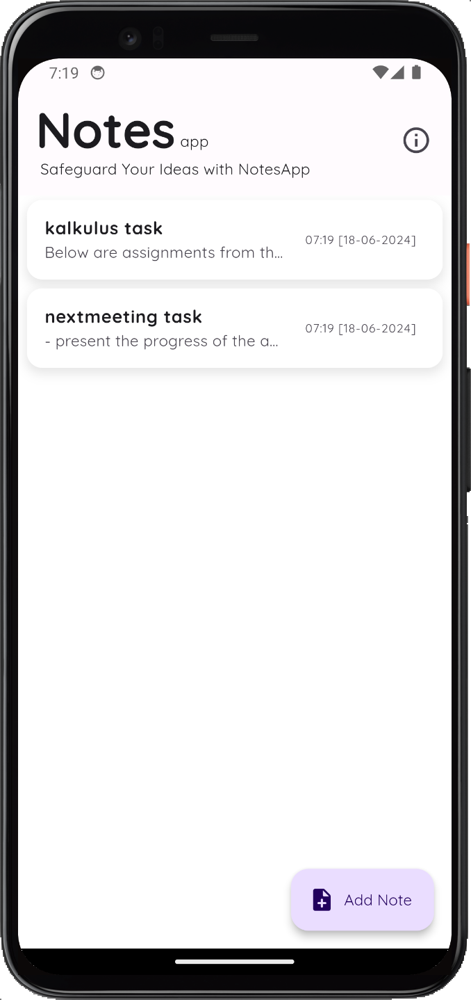
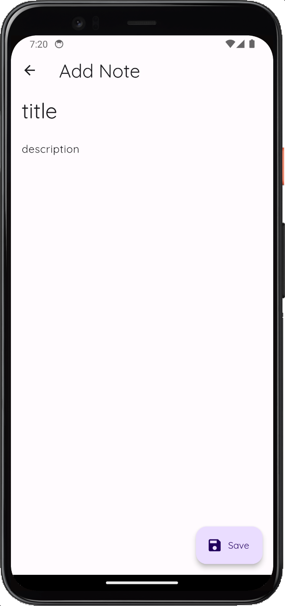

# NotesApp Mobile

Abank adalah aplikasi android yang dirancang untuk membantu pengguna mengelola keuangan pribadi mereka dengan mudah dan efektif.

## Features

- **Melihat Pemasukan dan Pengeluaran**: Users bisa melihat Pemasukan dan Pengeluaran yang telah tercatat.
- **Membuat Pencatatan Transaksi Keuangan**: Users dapat menambahkan catatan keuangan mereka.
- **Edit Pencatatan Transaksi**: Users bisa mengedit catatan keuangan mereka yang sudah ada sebelumnya.
- **Hapus Pencatatan Transaksi**: Users bisa menghapus catatan keuangan yang tidak dibutuhkan lagi.
- **CRUD Kategori**: Users bisa CRUD kategori.

## App Development
- **Fitur Merekap Jumlah Pemasukan dan Pengeluaran**: Sekarang aplikasi sudah bisa merekap Pemasukan dan Pengeluaran.
- **Perbaikan Bug**: Mengurangi Bug yang ada.

## Technologies Used

### Frontend
- **Dart**: The main programming language used for developing this application.
- **Flutter**: A framework for building responsive and attractive user interfaces.

### Dependencies
- **sqflite**: To handle local database storage.
- **path_provider**: To find commonly used locations on the filesystem.
- **initl**: To format dates and other localization needs.
- **cupertino_icons**: 
- **drift**: 
- **sqlite3_flutter_libs**:
- **path_provider**: 
- **path**: 
- **calendar_appbar**: 
- **google_fonts**: 
- **flutter_lints**:
- **drift_dev**: 
- **build_runner**:

## Project Thumbnail 

    
    &nbsp;&nbsp;
    
    &nbsp;&nbsp;
    

